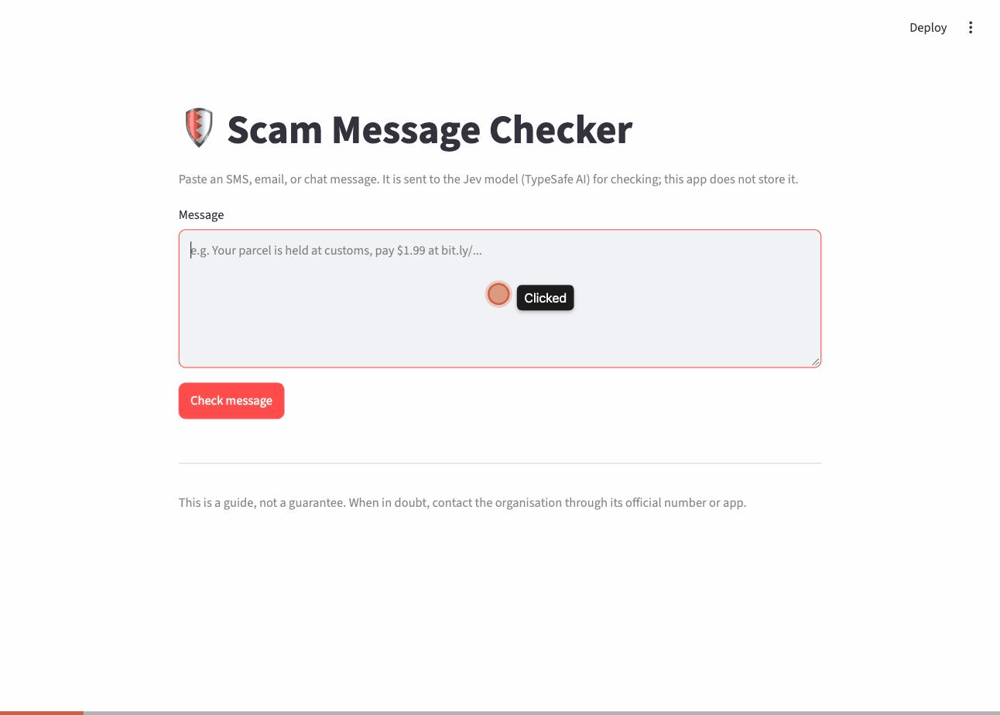

# Scam-Message-Checker
For Claude Agentic Coding Course

Paste a message into a Streamlit page and get a verdict (scam / suspicious / legit), a risk score, red flags and advice. Uses TypeSafe AI's Jev model (`jev-latest`) through the TypeSafe API. Claude models remain available as an optional provider.

## How to use
Paste a message, click **Check message**, read the verdict, then open **Details** for the full breakdown.

| Verdict | What it means | What to do |
|---|---|---|
| 🚨 **Likely scam** (risk 70–100) | Clear scam tactics, listed under **Red flags** | Don't reply, click or pay. Contact the organisation through its official app or number. |
| ⚠️ **Suspicious, verify first** (risk 30–69) | Some warning signs, but not conclusive | Don't act yet. Check with the sender through a channel you already trust. |
| ✅ **Looks legit** (risk 0–29) | No meaningful warning signs | Fine to act on, but still never share codes or passwords. |

If Jev is less than 60% sure, a yellow **"Jev isn't sure"** note names the next most likely verdict. **Details** shows the chance of each verdict, a score for each of the 9 scam-tactic checks (⚠️ = above 50%), the prompt-injection check and the keyword hints.

**1. Detected scam:** SingPost $1.50 customs-fee message → 🚨 Likely scam, with impersonation, unusual payment and link red flags.



**2. Not a scam:** a real DBS OTP text that says "Do not share this OTP" → ✅ Looks legit.


> In **Details**, "Plays on emotion or secrecy" shows ⚠️ 63% here: Jev reads the standard "do not share" warning as secrecy. The verdict ignores it, but it's a known quirk.

**3. Suspicious:** "I was cleaning out my contacts… is this David?" → ⚠️ Suspicious, flagged as a wrong-number opener. These often lead into investment scams.


## Setup
```bash
python3 -m venv .venv && source .venv/bin/activate
pip install -e ".[dev]"
cp .env.example .env   # then set TYPESAFE_API_KEY
```

## Run
```bash
streamlit run app.py           # web UI
pytest                         # offline tests (the API is mocked)
python -m evals.run_eval --repeats 3 --workers 4   # v2 vs v3 question sets on Jev
python -m evals.run_eval --rules-only   # free regex baseline
```

## Layout
```
src/scamcheck/checker.py   check(message, config): the one function the app and the eval share
src/scamcheck/rules.py     regex hints (never the final verdict)
src/scamcheck/providers/jev.py  Jev question sets (v1-v3) and answer -> Verdict mapping
src/scamcheck/prompts/     Claude prompts (optional provider)
src/scamcheck/config.py    models, pricing, DEFAULT_CONFIG (chosen by the eval)
evals/                     dataset.jsonl, run_eval.py, metrics.py, results/REPORT.md
```

## Extra-knowledge build: Evaluation (option 4)
This project's extra agent-engineering piece is a **small, repeatable evaluation** that compares Jev question sets (input formats) and uses the results to make project decisions.

- **What:** `evals/run_eval.py` runs every message in `evals/dataset.jsonl` (72 labelled messages) through the same `check()` function the app uses. It repeats each config to measure run-to-run variation and scores it against a pass bar written down before each run: scam recall ≥ 90%, legit false positives ≤ 10%, 0 errors.
- **Decisions it made:**
  1. **v2 over v1:** v1 flagged 20% of real messages, including bank OTP texts.
  2. **v3 over v2:** after a user review found wrong-number / friendly-opener scams missing, v3 got 27 of 30 target messages right against v2's 10 of 30, and legit false positives fell from 8% to 3%.
- **Evidence:** raw runs in `evals/results/*.json`; write-up, failed attempts and limitations in [`evals/results/REPORT.md`](evals/results/REPORT.md).
- **Failed attempt:** the free OpenCode tier rate-limited the first run (96 of 180 calls failed), then the retry code slept through a 17.8-hour quota reset until it was fixed to fail fast.
- **Limitation:** 72 messages written by us are cleaner than real scams, and wrong-number scams depend on who sent them, which the checker can't see.

```bash
python -m evals.run_eval --repeats 3 --workers 4   # v2 vs v3, about $0.015
```
